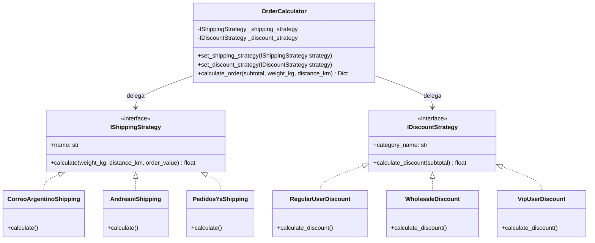

# 📐 Calculadora de Envíos y Descuentos — Patrón Strategy (Diseño de Software)

Proyecto práctico y educativo enfocado en la implementación del **Patrón de Diseño Comportamental Strategy (Estrategia)** en Python. Diseñado como material didáctico para una **presentación universitaria**, incluye arquitectura limpia, pruebas unitarias automatizadas, ejecutable de consola CLI e interfaz web interactiva para exposición visual.

---

## 🎯 Objetivo de la Presentación Universitario

Demostrar cómo el patrón **Strategy** permite intercambiar algoritmos de **cálculo de envíos por logística** (*Correo Argentino, Andreani, PedidosYa*) y **descuentos por categoría de usuario** (*Regular, Mayorista, VIP*) en tiempo de ejecución, respetando el principio de **Abierto/Cerrado (Open/Closed Principle)** del paradigma SOLID.

---

## 🏗️ Diagrama de Clases (UML)



---

## 📁 Estructura del Proyecto

```text
Calculadora-envios-descuentos/
├── src/
│   ├── strategies/
│   │   ├── __init__.py
│   │   ├── base.py                 <-- IShippingStrategy e IDiscountStrategy (Interfaces)
│   │   ├── shipping_strategies.py  <-- Correo Argentino, Andreani, PedidosYa
│   │   └── discount_strategies.py  <-- Regular, Mayorista, VIP
│   ├── context/
│   │   ├── __init__.py
│   │   └── calculator_context.py   <-- OrderCalculator (El Contexto)
│   └── main.py                     <-- Punto de entrada / Menú CLI / Lanzador Web
├── web/                            <-- Interfaz gráfica web interactiva para la defensa
│   ├── index.html
│   ├── styles.css
│   └── app.js
├── tests/
│   ├── __init__.py
│   └── test_strategies.py          <-- Pruebas unitarias completas (12 tests)
├── .gitignore
├── LICENSE
└── README.md
```

---

## 💡 Algoritmos de las Estrategias Implementadas

### 🚚 Estrategias de Envío (`IShippingStrategy`)
1. **Correo Argentino** (`CorreoArgentinoShipping`):
   - Tarifa base: `$1.200 ARS`.
   - Costo variable: `$350 ARS/kg` + `$8 ARS/km`.
   - **Bonificación**: 50% de descuento en el costo de envío si la compra supera los `$50.000 ARS`.
2. **Andreani** (`AndreaniShipping`):
   - Tarifa base fija: `$2.500 ARS` (incluye seguro de carga).
   - Tramos por peso: `hasta 5kg (+$500)`, `5 a 15kg (+$1.200)`, `>15kg (+$2.500)`.
   - Costo por distancia: `$12 ARS/km`.
3. **PedidosYa** (`PedidosYaShipping`):
   - Servicio urbano de corta distancia (límite máximo: `15 km`).
   - Tarifa base: `$800 ARS` + `$150 ARS/km`.
   - Recargo por paquete pesado: `+$600 ARS` si el peso supera los `5 kg`.

### 👤 Estrategias de Descuento (`IDiscountStrategy`)
1. **Cliente Regular** (`RegularUserDiscount`):
   - Descuento base: `0%`.
   - Premio por fidelidad: `3%` de descuento en compras mayores a `$100.000 ARS`.
2. **Cliente Mayorista** (`WholesaleDiscount`):
   - Descuento base: `15%`.
   - Descuento por volumen: `20%` en compras mayores a `$80.000 ARS`.
3. **Cliente VIP** (`VipUserDiscount`):
   - Descuento exclusivo: `25%` fijo.
   - Regalo adicional: Cupón de `+$1.000 ARS` bonificados en compras superiores a `$30.000 ARS`.

---

## 🚀 Guía de Ejecución

### 1. Ejecutar las Pruebas Unitarias
Para validar que todas las estrategias y el contexto funcionan correctamente:
```bash
python -m unittest discover -s tests
```

### 2. Ejecutar la Consola Interactiva (CLI)
Para correr la demostración por consola con menú explicativo:
```bash
python src/main.py
```

### 3. Abrir la Interfaz Web Visual para la Presentación
Desde el menú interactivo de `main.py` selecciona la opción **3**, o inicia un servidor local en la carpeta `web/`:
- Se abrirá automáticamente una dashboard web moderna con glassmorphism, simulación en vivo, diagrama UML e inspector de código en tiempo real para proyectar en el aula.

---

## 🎤 Guión Sugerido para la Exposición en la Facultad

1. **Introducción al Problema**:
   > *"En una tienda electrónica, calcular el costo final implica combinar la empresa de logística y el tipo de cliente. Si usáramos estructuras condicionales (if/else o switch), el código terminaría acoplado, difícil de mantener y violando el principio de responsabilidad única."*

2. **Solución con el Patrón Strategy**:
   > *"Separamos los algoritmos de cálculo de la clase cliente. Definimos dos abstracciones: `IShippingStrategy` e `IDiscountStrategy`. El objeto `OrderCalculator` actúa como el Contexto y delega los cálculos."*

3. **Demostración de Flexibilidad (Runtime)**:
   > *"Al cambiar de empresa de envío o tipo de cliente, simplemente inyectamos una instancia diferente al contexto mediante `set_shipping_strategy()` o `set_discount_strategy()`. El método `calculate_order()` ejecuta el cálculo sin cambiar su código."*

4. **Beneficios Principales**:
   - **Mantenibilidad**: Agregar una nueva empresa (ej. *OCASA*) implica solo crear una nueva clase que implemente `IShippingStrategy`.
   - **Testabilidad**: Cada estrategia se prueba de manera aislada con sus propios tests unitarios.
