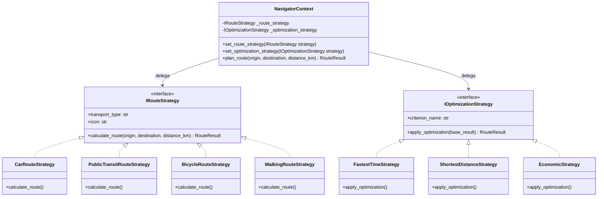

# 🗺️ Planificador de Rutas (Google Maps / Waze) — Patrón Strategy (Diseño de Software)

Proyecto práctico y educativo enfocado en la implementación del **Patrón de Diseño Comportamental Strategy (Estrategia)** en Python, aplicado al dominio de navegación inteligente y planificación de rutas estilo **Google Maps**. Diseñado como material didáctico para una **presentación universitaria**, incluye arquitectura limpia, pruebas unitarias automatizadas, ejecutable de consola CLI e interfaz web GPS interactiva en vivo.

---

## 🎯 Objetivo de la Presentación Universitaria

Demostrar cómo el patrón **Strategy** permite intercambiar los algoritmos de **navegación por medio de transporte** (*Automóvil, Transporte Público/Colectivo, Bicicleta, A Pie*) y los **criterios de optimización** (*Más Rápida, Más Corta, Económica*) en tiempo de ejecución, respetando el principio de **Abierto/Cerrado (Open/Closed Principle)** del paradigma SOLID.

---

## 🏗️ Diagrama de Clases (UML)


```mermaid
classDiagram
    class NavigatorContext {
        -IRouteStrategy _route_strategy
        -IOptimizationStrategy _optimization_strategy
        +set_route_strategy(IRouteStrategy strategy)
        +set_optimization_strategy(IOptimizationStrategy strategy)
        +plan_route(origin, destination, distance_km) RouteResult
    }

    class IRouteStrategy {
        <<interface>>
        +transport_type: str
        +icon: str
        +calculate_route(origin, destination, distance_km) RouteResult
    }

    class IOptimizationStrategy {
        <<interface>>
        +criterion_name: str
        +apply_optimization(base_result) RouteResult
    }

    class CarRouteStrategy {
        +calculate_route()
    }
    class PublicTransitRouteStrategy {
        +calculate_route()
    }
    class BicycleRouteStrategy {
        +calculate_route()
    }
    class WalkingRouteStrategy {
        +calculate_route()
    }

    class FastestTimeStrategy {
        +apply_optimization()
    }
    class ShortestDistanceStrategy {
        +apply_optimization()
    }
    class EconomicStrategy {
        +apply_optimization()
    }

    NavigatorContext --> IRouteStrategy : delega
    NavigatorContext --> IOptimizationStrategy : delega

    IRouteStrategy <|.. CarRouteStrategy
    IRouteStrategy <|.. PublicTransitRouteStrategy
    IRouteStrategy <|.. BicycleRouteStrategy
    IRouteStrategy <|.. WalkingRouteStrategy

    IOptimizationStrategy <|.. FastestTimeStrategy
    IOptimizationStrategy <|.. ShortestDistanceStrategy
    IOptimizationStrategy <|.. EconomicStrategy
```

---

## 📁 Estructura del Proyecto

```text
Calculadora-envios-descuentos/
├── src/
│   ├── strategies/
│   │   ├── __init__.py
│   │   ├── base.py                     <-- IRouteStrategy e IOptimizationStrategy (Interfaces)
│   │   ├── route_strategies.py         <-- Auto, Colectivo, Bici, A Pie
│   │   └── optimization_strategies.py  <-- Más Rápida, Más Corta, Económica
│   ├── context/
│   │   ├── __init__.py
│   │   └── navigator_context.py        <-- NavigatorContext (El Contexto)
│   └── main.py                         <-- Punto de entrada / Menú CLI / Lanzador Web GPS
├── web/                                <-- Dashboard Web GPS estilo Google Maps Dark Mode
│   ├── index.html
│   ├── styles.css
│   └── app.js
├── tests/
│   ├── __init__.py
│   └── test_route_strategies.py        <-- Pruebas unitarias completas
├── .gitignore
├── LICENSE
└── README.md                           <-- Documentación con Diagrama UML y Guión
```

---

## 💡 Algoritmos de las Estrategias Implementadas

### 🚗 Estrategias de Transporte (`IRouteStrategy`)
1. **Automóvil** (`CarRouteStrategy`):
   - Velocidad promedio: `60 km/h` (vías rápidas y autopista).
   - Costos: Combustible (`$180 ARS/km`) + Peaje (`$800 ARS` si dist > 10km).
2. **Transporte Público** (`PublicTransitRouteStrategy`):
   - Velocidad promedio: `25 km/h` + `8 min` de espera promedio en estación.
   - Costo: Tarifa SUBE (`$450 ARS base + $30 ARS/km`).
   - Ecológico: Ahorro de `~0.14 kg CO2/km`.
3. **Bicicleta** (`BicycleRouteStrategy`):
   - Velocidad promedio: `15 km/h`. Red de ciclovías protegidas.
   - Costo: `$0 ARS`. Salud & CO2: `30 kcal/km` y `0.21 kg CO2/km` ahorrados.
4. **A Pie / Peatonal** (`WalkingRouteStrategy`):
   - Velocidad promedio: `5 km/h`. Pasajes peatonales y contramanos.
   - Costo: `$0 ARS`. Salud: `~1.350 pasos/km` y `55 kcal/km`.

### ⚡ Estrategias de Optimización (`IOptimizationStrategy`)
1. **Ruta Más Rápida** (`FastestTimeStrategy`): Prioriza el menor tiempo estimado (ETA) reduciendo un 10% el tiempo de viaje con onda verde.
2. **Ruta Más Corta** (`ShortestDistanceStrategy`): Prioriza el menor recorrido en kilómetros reduciendo un 5% la distancia con pasajes directos.
3. **Ruta Económica** (`EconomicStrategy`): Elimina o bonifica peajes y gastos monetarios.

---

## 🚀 Guía de Ejecución

### 1. Ejecutar las Pruebas Unitarias
Para validar que todas las estrategias y el navegador funcionan correctamente:
```bash
python -m unittest discover -s tests
```

### 2. Ejecutar la Consola Interactiva (CLI)
Para correr la demostración por consola con menú explicativo:
```bash
python src/main.py
```

### 3. Abrir la Interfaz Web Visual GPS para la Presentación
Desde el menú interactivo de `main.py` selecciona la opción **3**, o inicia un servidor local en la carpeta `web/`:
- Se abrirá automáticamente un navegador GPS interactivo en vivo estilo Google Maps Dark Mode con mapa simulado, itinerario de waypoints, diagrama UML e inspector de código en tiempo real.

---

## 🎤 Guión Sugerido para la Exposición en la Facultad

1. **Introducción al Ejemplo Clásico**:
   > *"Google Maps necesita calcular rutas según el medio de transporte elegido por el usuario (Auto, Colectivo, Bici, A Pie). Cada transporte utiliza algoritmos de cálculo completamente distintos para tiempos, velocidad y costos."*

2. **Por qué usar el Patrón Strategy**:
   > *"Si pusiéramos todo en un único método con condicionales `if/else`, violaríamos la Responsabilidad Única y el código sería frágil. Con Strategy, el `NavigatorContext` (el Navegador) delega el cálculo a interfaces abstractas (`IRouteStrategy` e `IOptimizationStrategy`)."*

3. **Demostración de Flexibilidad (Runtime)**:
   > *"Al tocar un botón en la interfaz, el navegador inyecta una nueva estrategia concreta en tiempo de ejecución. El método `plan_route()` calcula el itinerario completo sin modificar una sola línea de su código fuente."*

4. **Extensibilidad SOLID (Open/Closed Principle)**:
   > *"Si mañana quisiéramos agregar el transporte en Moto o Monopatín Eléctrico, simplemente creamos una clase nueva que implemente `IRouteStrategy` sin alterar las clases existentes."*
